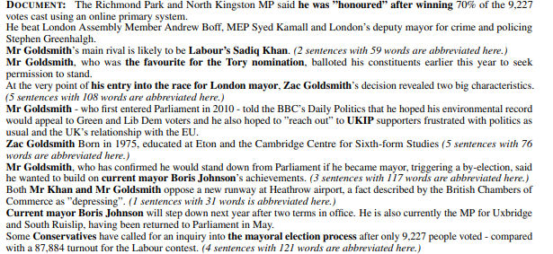
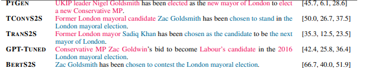

Example:

Important details that were often mixed up were highlighted.
These are the summerizations generated by AI:

The correct summerizations are highlighted in **Blue**, while incorrect summerizations are highlighted in **Red**. You can see, for example, that it mixed up _"Zach Goldsmith"_ to _"Nigel Goldsmith"_, or if he was elected or just a candidate for elections.
There are 4 questions to answer here:
1. How frequently do generative AI models hallucinate content?
2. Do models hallucinate by manipulating the information present in the input document (intrinsic hallucinations), or by adding information they "made up" (extrinsic hallucinations)?
3. How much hallucinated content is _factual_ (Not accurate, but still correct)?
4. Are there automatic means of measuring these hallucinations?
First of all, hallucinations happen frequently. In almost 70% of single-sentence summerizations